# Iegriez Pasauli
<h3><a href="https://iegriez-pasauli-hackathon-robzlegz.vercel.app/">Apmeklēt</a> (Ctrl + click)</h3>
<h2>Noteikumi:</h2>
<ul>
  <li>1. Spiediet pogu "Sākt spēli".</li>
  <li>2. Lai iegrieztu ratu Jums ir jānospiež poga "Iegriezt".</li>
  <li>3. Rats Jums noteiks tēmu un pēc tam, tiks uzdoti jautājumi par noteikto tēmu.</li>
  <li>4. Pirmajā kārtā tiks uzdoti 5 jautājumi un par katru pareizo atbildi jūs saņemsiet 1 punktu.</li>
  <li>5. Pēc tam jūs nonāksiet Eiropas kartē, kur spiežot uz simbola Jūs saņemsiet jautājumu.</li>
  <li>6. Otrajā kārtā par katru pareizi atbildēto jautājumu Jūs saņemsiet 5 punktus.</li>
  <li>7. Trešajā kārtā Jūsu uzdevums ir pēc iespējas vairāk atlasīt vārdus vai vārdu savienojumus, kas saistīti ar aprites ekonomiku.</li>
  <li>8. Pēc trešās kārtas Jūs uzzināsiet cik punktus nopelnījāt un kāda ir jūsu loma.</li>
  <li>9. Ja vēlēsieties, varēsiet pievienoties spēlētāju topam</li>
</ul>

<h2>Administrātora iespējas:</h2>
<h4>Lai mainītu jautājumus un atbildes vajag pierakstīties <a href="https://iegriez-pasauli-api.herokuapp.com/admin/">šeit</a>.</h4>

<h4>Kad pierakstaties, varat rediģēt jautājumus un atbildes</h4>

<h5>Sadaļā "CORE/Members" var redzēt spēlētāju topu un spēlētāju rezultātus.</h5>
<h5>Sadaļā "CORE/Questions" var rediģēt jautājumus un papildus informāciju.</h5>
<h5>Sadaļā"CORE/Options" var rediģēt atbildes uz jautājumiem</h5>
 

<h4>Lai rediģētu jautājumus:</h4>
<ul>
  <li>1. Aizejiet uz sadaļu "CORE/Questions"</li>
  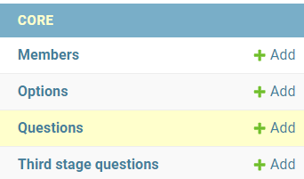

  <li>2. Atrodiet jautājumu, kuru vēlaties rediģēt</li>
  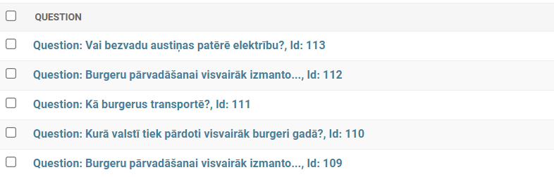

  <li>3. Kad uzklikšķinat uz kādu jautājumu, Jūs nonāksiet šajā lapā:</li>
  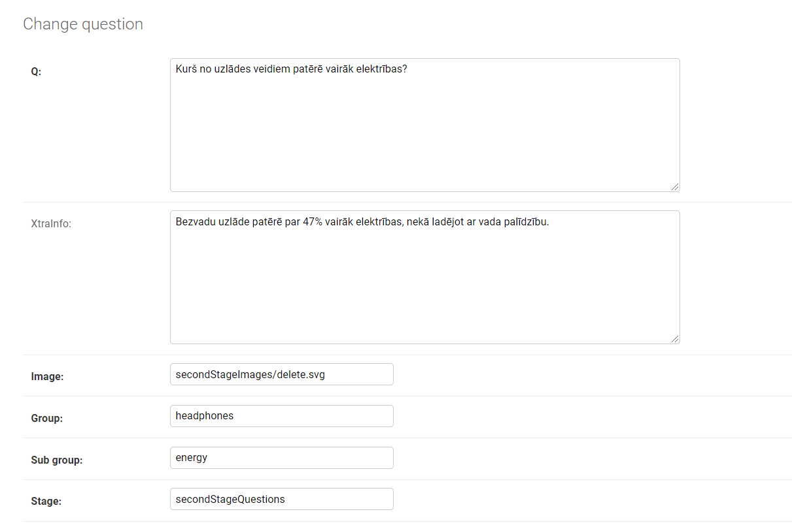

  <li>4. Sadaļā Q varat rediģēt pašu jautājumu</li>
  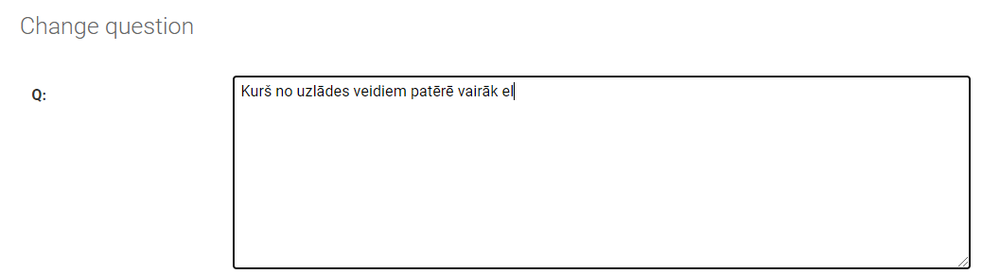

  <li>5. Sadaļā xtraInfo varat rediģēt vai pievienot papildus informāciju saistībā ar jautājumu</li>
  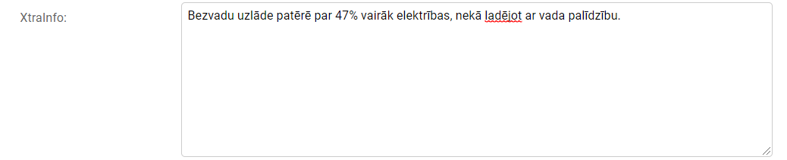

  <li>6. Kad beidzat rediģēt, saglabājiet izmaiņas</li>
  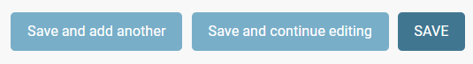

  <li>! Uzmanību šos lauciņus lūdzu nemainīt</li>
  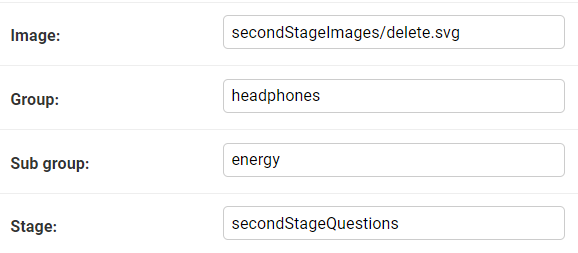
</ul>
 

<h4>Lai rediģētu atbildes:</h4>
<ul>
  <li>1. Aizejiet uz sadaļu "CORE/Options".</li>
  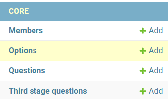
  

  <li>2. Atrodiet atbildi, kuru vēlaties rediģēt.</li>
  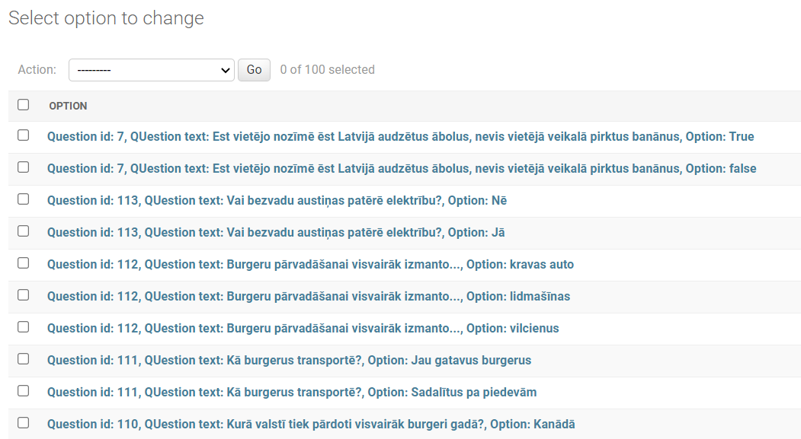
  

  <li>3. Atbildei priekšā ir dots jautājums, uz kuru attiecas atbildes opcija.</li>
  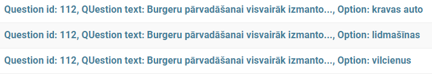
  

  <li>4. Kad noklikšķināsiet uz kādu atbildi, nonāksiet šajā lapā.</li>
  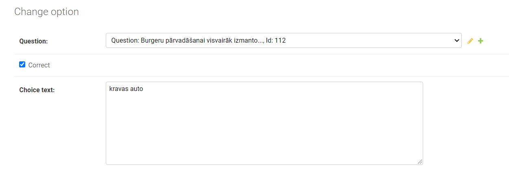
  

  <li>5. Atbildes opciju varat rediģēt šeit:</li>
  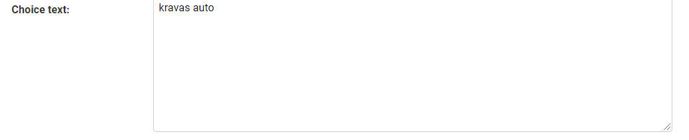
  

  <li>6. Ar šo checkbox varat norādīt vai atbildes opcija ir pareiza</li>
  
!!!Uzmanību---> Katrā jautājumā obligāti jābūt vienai pareizai atbilžu opcijai

  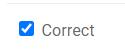
  

  <li>6. Kad beidzat rediģēt, saglabājiet izmaiņas</li>
    
  

  <li>! Uzmanību šo lauciņu lūdzu nemainīt</li>
  
</ul>

