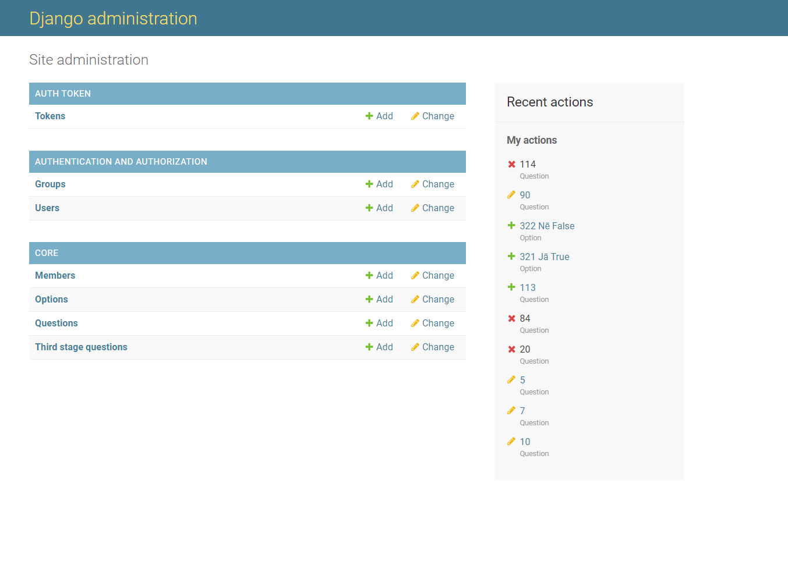
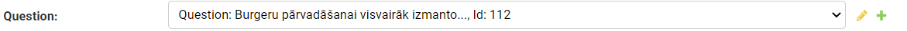
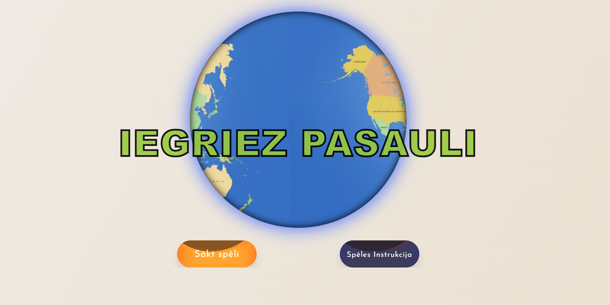
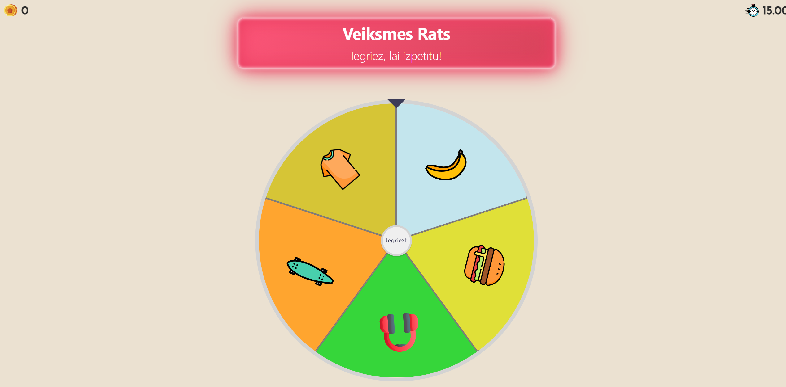
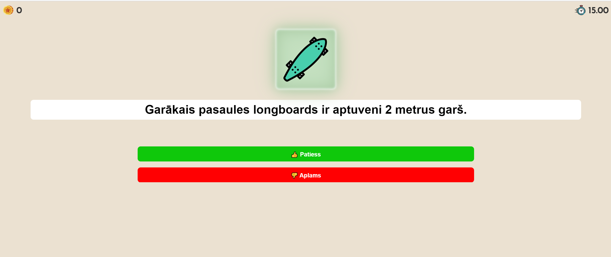

# Iegriez Pasauli
<h3><a href="https://iegriez-pasauli-hackathon-robzlegz.vercel.app/">Apmeklēt</a> (Ctrl + click)</h3>
<h2>Spēles noteikumi:</h2>
<ul>
  <li>1. Spiediet pogu "Sākt spēli".</li>
  <li>2. Lai iegrieztu ratu Jums ir jānospiež poga "Iegriezt".</li>
  <li>3. Rats Jums noteiks tēmu un pēc tam, tiks uzdoti jautājumi par noteikto tēmu.</li>
  <li>4. Pirmajā kārtā tiks uzdoti 5 jautājumi un par katru pareizo atbildi jūs saņemsiet 1 punktu.</li>
  <li>5. Pēc tam jūs nonāksiet Eiropas kartē, kur spiežot uz simbola Jūs saņemsiet jautājumu.</li>
  <li>6. Otrajā kārtā par katru pareizi atbildēto jautājumu Jūs saņemsiet 5 punktus.</li>
  <li>7. Trešajā kārtā Jūsu uzdevums ir pēc iespējas vairāk atlasīt vārdus vai vārdu savienojumus, kas saistīti ar aprites ekonomiku.</li>
  <li>8. Pēc trešās kārtas Jūs uzzināsiet cik punktus nopelnījāt un kāda ir jūsu loma.</li>
  <li>9. Ja vēlēsieties, varēsiet pievienoties spēlētāju topam</li>
</ul>

<h2>Spēles papildinājums no Team-Datorium:</h2>
<ul>
  <li>1. Administratora panelis</li>
  <li>2. "Responsive" dizains</li>
  <li>3. Spēlētāju tops</li>
</ul>

<h2>Kā palaist aplikāciju?</h2>
<ul>
  <li>0. Instalē nodeJS <a href="https://nodejs.org/en/">šeit</a></li>
  <li>1. Atver kodu teksta rediģētājā</li>
  <li>2. Atver termināli(<code>Ctrl + `</code>)</li>
  <li>3. Terminālī ieraksti: <code>npm install</code></li>
  <li>4. Terminālī ieraksti: <code>npm start</code></li>
</ul>

<h2>Izmantotās tehnoloģijas:</h2>
<ul>
  <li>* ReactJS</li>
  <li>* JavaScript</li>
  <li>* Redux</li>
  <li>* Python-Django</li>
  <li>* Styled-Components</li>
</ul>

<h2>Administrātora iespējas:</h2>
<h3>Adminstratora apmācības video: (<a href="https://www.youtube.com/watch?v=XLu160j9yuE">Apmācība</a>)</h3>
<h4>Lai mainītu jautājumus un atbildes vajag pierakstīties <a href="https://iegriez-pasauli-api.herokuapp.com/admin/">šeit</a>.</h4>

<h4>Kad pierakstaties, varat rediģēt jautājumus un atbildes</h4>

<h5>Sadaļā "CORE/Members" var redzēt spēlētāju topu un spēlētāju rezultātus.</h5>
<h5>Sadaļā "CORE/Questions" var rediģēt jautājumus un papildus informāciju.</h5>
<h5>Sadaļā"CORE/Options" var rediģēt atbildes uz jautājumiem</h5>
 

<h3>Lai rediģētu jautājumus:</h3>
<ul>
  <li>1. Aizejiet uz sadaļu "CORE/Questions"</li>
  

  <li>2. Atrodiet jautājumu, kuru vēlaties rediģēt</li>
  

  <li>3. Kad uzklikšķinat uz kādu jautājumu, Jūs nonāksiet šajā lapā:</li>
  

  <li>4. Sadaļā Q varat rediģēt pašu jautājumu</li>
  

  <li>5. Sadaļā xtraInfo varat rediģēt vai pievienot papildus informāciju saistībā ar jautājumu</li>
  

  <li>6. Kad beidzat rediģēt, saglabājiet izmaiņas</li>
  

  <li>! Uzmanību šos lauciņus lūdzu nemainīt</li>
  
</ul>
 

 
 
<h3>Lai rediģētu atbildes:</h3>
<ul>
  <li>1. Aizejiet uz sadaļu "CORE/Options".</li>
  
  

  <li>2. Atrodiet atbildi, kuru vēlaties rediģēt.</li>
  
  

  <li>3. Atbildei priekšā ir dots jautājums, uz kuru attiecas atbildes opcija.</li>
  
  

  <li>4. Kad noklikšķināsiet uz kādu atbildi, nonāksiet šajā lapā.</li>
  
  

  <li>5. Atbildes opciju varat rediģēt šeit:</li>
  
  

  <li>6. Ar šo checkbox varat norādīt vai atbildes opcija ir pareiza</li>
  
!!!Uzmanību---> Katrā jautājumā obligāti jābūt vienai pareizai atbilžu opcijai

  
  

  <li>7. Kad beidzat rediģēt, saglabājiet izmaiņas</li>
    
  

  <li>! Uzmanību šo lauciņu lūdzu nemainīt</li>
  
</ul>

 
<h2>Noderīgas saites:</h2>
 
<ul>
  <li>1. <code><a href="https://github.com/MareksNo/test-dir-api/tree/fixing-bugs">Backend repository</a></code></li>
</ul>

 
<h2>API Routes</h2>
<ul>
  <li><a href="https://iegriez-pasauli-api.herokuapp.com/admin/">Admin Panelis</a></li>
   
  <li><a href="https://iegriez-pasauli-api.herokuapp.com/api/questions/">Jautājumu viewsets</a></li>
  <li><a href="https://iegriez-pasauli-api.herokuapp.com/api/thirdstage/">Trešās stadijas viewsets</a></li>
  <li><a href="https://iegriez-pasauli-api.herokuapp.com/api/members/">Leaderboard dalībnieku viewsets</a></li>
   
  <li><a href="https://iegriez-pasauli-api.herokuapp.com/auth/">Autetifikācijas tokena iegūšana, tikai POST requests.</a></li>
</ul>

 
<h2>Ekrānuzņēmumi:</h2>
 

