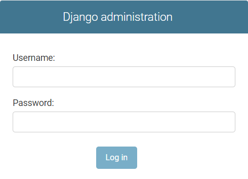

# Iegriez Pasauli
<a href="https://iegriez-pasauli-hackathon-robzlegz.vercel.app/">Apmeklēt</a> (Ctrl + click)
 
<h2>Noteikumi:</h2>
<ul>
  <li>1. Spiediet pogu "Sākt spēli".</li>
  <li>2. Lai iegrieztu ratu Jums ir jānospiež poga "Iegriezt".</li>
  <li>3. Rats Jums noteiks tēmu un pēc tam, tiks uzdoti jautājumi par noteikto tēmu.</li>
  <li>4. Pirmajā kārtā tiks uzdoti 5 jautājumi un par katru pareizo atbildi jūs saņemsiet 1 punktu.</li>
  <li>5. Pēc tam jūs nonāksiet Eiropas kartē, kur spiežot uz simbola Jūs saņemsiet jautājumu.</li>
  <li>6. Otrajā kārtā par katru pareizi atbildēto jautājumu Jūs saņemsiet 5 punktus.</li>
  <li>7. Trešajā kārtā Jūsu uzdevums ir pēc iespējas vairāk atlasīt vārdus vai vārdu savienojumus, kas saistīti ar aprites ekonomiku.</li>
  <li>8. Pēc trešās kārtas Jūs uzzināsiet cik punktus nopelnījāt un kāda ir jūsu loma.</li>
  <li>9. Ja vēlēsieties, varēsiet pievienoties spēlētāju topam</li>
</ul>
<h2>Administrātora iespējas:</h2>

